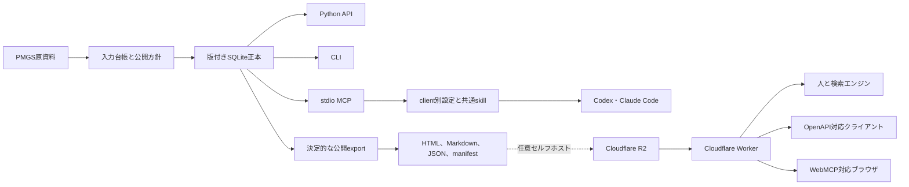

# PMGS Reference v1 設計計画

- 初版作成日: 2026-08-08
- 最終更新日: 2026-08-13
- 対象: JPOの登録制一括ダウンロードサービスから取得したPMGSパッケージ
- 利用者: Codex・Claude Code利用者、ローカル開発者、任意Web公開者、検索エンジン、GPTs、Gem、Copilot Studio、MCPクライアント

## 目的

PMGS Referenceは、PMGSパッケージを版付きSQLiteへ変換し、同じ正本から複数の読み取り専用参照面を生成する。

ローカル参照面はPython API、CLI、stdio MCPで構成する。

日本語をREADME、skill、照会、公開ページの既定言語とし、英語は明示的に切り替えられる状態を維持する。

公開参照面はサーバー描画HTML、Markdown、JSON、OpenAPIで構成する。

WebMCPは対応ブラウザ向けの追加機能として提供し、通常のウェブ参照やAPI参照の必須条件にはしない。

本プロジェクトは分類定義の参照基盤であり、特許分類の推薦、特許分析、法的判断、AI要約を提供しない。

## 現在の実装状態

ローカル正本、Python API、CLI、stdio MCP、Codex・Claude Code用agent kit、決定的な公開export、Cloudflare Worker、OpenAPI、WebMCPアダプターは実装済みである。

2026-08-09に、公開ページの帰属表示、原典リンク、加工表示、非公式サービス表示を必須契約へ追加した。

2026-08-09時点の旧schemaと表示契約は、合成fixtureと実データ全量監査で検証済みである。

実データA/Bは各399,025オブジェクト、10,491,136,463 bytesで一致し、全件validatorとrelease auditは`ready=true`、`failures=[]`となった。

2026-08-10に日本語topと日本語`llms.txt`を既定にし、英語切替先を追加した。この新しい入口契約は合成fixtureで検証し、Web公開時に実originで全量A/B監査を再実行する。

この旧監査結果は回帰資料として保持するが、schema v2と分類record 2.0の合格証拠には継承しない。

2026-08-11に、全OS共通の`pmgs setup`、内容アドレス付きSQLite、原子的な`current.json`、Codex・Claude Codeの非破壊登録、wheel実環境test、PyPI Trusted Publishing用release workflowをv0.3.0として追加した。PyPI packageとv0.3.0 Releaseの外部公開はtagと承認環境による別状態として扱う。

2026-08-13に、分類概念と版ごとのrevisionを分離するschema v2、IPCの基準日版選択、FI改正の`reference_only`概念、出典lineage、関係ページング、分類・文書の複合検索をv0.4.0として実装・検証し、Pull Request #6からmainへ統合した。PMGS保有者向けのPyPI-first導線、dry-run、AI向け機械可読説明はPull Request #8からmainへ統合した。実データA/B、Codex実MCP評価、hosted CI、CodeQLに合格している。Claude Code用設定、skill、登録、分離環境、tool制限は自動検証済みだが、現在利用できる無料アカウントではlive MCP評価に必要なClaudeモデル呼出しを実行できないため、live MCP評価は`not_observed`として残す。現在の検証状態と外部公開Holdは[現在の状態](docs/current-status.md)を正本とする。

GitHub source repository、PyPI v0.4.0、GitHub Release v0.4.0を現在の配布面とする。Web deploy、domain公開、R2 upload、外部検索エンジンへの登録は停止中の別外部状態であり、第三者向けセルフホスト手順だけを提供する。

## v1の設計原則

1. PMGS原資料は読み取り専用入力として扱う。
2. Pythonだけが入力形式の解釈と分類データの意味変換を行う。
3. SQLiteをローカルの版付き正本とする。
4. Python API、CLI、MCP、公開exportは同じ検索層とレコード契約を使う。
5. Workerは事前生成物の配信と入力検証だけを担当する。
6. 公式出典由来の本文と派生メタデータを分離する。
7. 不明な形式、意味、公開条件は推測せずfail closedにする。
8. 元パッケージ、正本SQLite、一括JSON、実質的なデッドコピーを公開しない。
9. 同じ入力と設定から同じ公開bytesを生成する。
10. 公開参照面がJPOまたはINPITの公式サービスに見えない表示を維持する。

## 対象範囲

### v1に含めるもの

- 全入力ファイルの相対識別子、サイズ、SHA-256、形式、処理状態を持つ台帳
- CSV、XML、HTML、PDFの専用adapter
- FI、Fターム、IPC、対応関係、改正資料、解説、ハンドブック、IPC定義文書
- 原資料に存在する日本語と英語
- 版付きSQLiteとFTS5によるローカル文字列検索
- Python API、CLI、stdio MCP
- CodexとClaude Codeに対応するclient別MCP設定、共通skill、診断、評価ケース
- 分類または文書単位のHTML、Markdown、JSON
- release manifest、coverage、OpenAPI、`llms.txt`、`robots.txt`、sitemap
- Cloudflare Workerによる読み取り専用配信
- feature detectionを使う読み取り専用WebMCP tool
- 決定性、完全性、漏えい、公開表示を検査するvalidatorとrelease audit

### v1に含めないもの

- 特許文献の分析、検索式生成、パテントマップ生成
- AI生成の要約、翻訳、説明
- 埋め込み、意味検索、分類推薦
- 公開全文検索API
- D1、Vectorize、Workers AI、AI Search
- Remote MCPと認証機構
- SPARQL
- 自動データ取得、自動公開、自動ドメイン切替
- PMGS元ファイル、正本SQLite、一括JSONの公開配布

## アーキテクチャ

Pythonは入力の解析、正規化、lineage、検索、公開成果物の生成を担当する。

WorkerはPMGSのCSV、XML、HTML、PDFを解析しない。

Workerは固定されたrelease catalogとmanifestからR2 keyを解決する。

分類照会と文書照会はmanifestと対象JSON chunkの最大2回のR2読み取りで完了する。

## 入力と完全性

`source-manifest.jsonl`は1行を1入力ファイルとする。

各行は相対パス、サイズ、SHA-256、形式、文字コード、データ群、parser、処理状態を持つ。

処理状態は`parsed`、`retained`、`failed`のいずれかとする。

未処理ファイルを暗黙に無視しない。

CSVは引用符内改行を保持して解析する。

XMLとHTMLは文書内の文字コード宣言を尊重し、回復解析で破損を隠さない。

PDF本文はページ単位で抽出し、空ページと抽出失敗を区別して記録する。

## SQLite正本

主要テーブルは次の責務を持つ。

| テーブル | 責務 |
| --- | --- |
| `release` | PMGS版、基準日、入力hash、schema版 |
| `release_source` | owner、原典案内URL、COPYRGHT、取得元lineage |
| `source_file` | 全入力ファイルの台帳 |
| `source_record` | 入力行または要素の損失のない監査表現 |
| `concept` | 分類体系、edition、コード、正規化コード、`canonical`または`reference_only` |
| `concept_revision` | version、有効期間、level、構造sequence、出典lineage |
| `concept_text` | revisionごとの言語、本文種別、行順、出典由来本文、翻訳状態 |
| `concept_property` | revisionごとのテーマ、観点、適用範囲などの属性 |
| `relation` | concept間の上位下位、対応関係 |
| `revision_relation` | revision間のIPC改正関係 |
| `document` | 文書メタデータ |
| `document_text` | ページまたは節単位の抽出本文 |
| `document_link` | 分類と文書の関係 |
| `document_revision_link` | revisionと改正文書の関係 |
| `build_issue` | 失敗、欠損、重複、未確認事項 |

`concept`の一意性はrelease、scheme、edition、normalized codeの組で保証する。
同じconceptの版ごとの差は`concept_revision`のversion indicatorで分離する。

FIとIPCに同じ表記のコードが存在しても別レコードとして保持する。

分類と文書の検索にはFTS5 trigramを使う。

3文字未満の検索語だけ、escape済みのリテラル部分一致へ切り替える。

## 正規化

照会では`scheme`を必須にする。

コード表記だけからFIとIPCを推測しない。

正規化は前後空白の除去、固定幅内部空白の除去、ASCII英字の大文字化に限定する。

`/`や`:`など意味を持つ分類記号は保持する。

PythonとTypeScriptは`schemas/normalization-vectors.json`を共通テストとして使う。

URL fragmentでは非ASCII英数字をUTF-8 byte単位の`_HH`へ変換し、記号削除による衝突を避ける。

## 共通公開レコード

分類レコードはrelease、reference date、scheme、edition、version、有効期間、record status、
code、normalized code、照合状態、本文、属性、ページング済み関係、文書、出典、canonical URLを持つ。

`match_status`は`exact`、`normalized_exact`、`invalid`、`not_found`、
`version_not_found`、`not_valid_at_release`のいずれかとする。

有力候補を推測して`exact`として返さない。

出典オブジェクトは次の項目を必須にする。

- source ID
- 資料名
- PMGSパッケージ内の相対識別子
- 権利者名
- JPOの原典案内URL
- SHA-256
- 帰属表示

公開レコードへローカル絶対パスを含めない。

## 公開方針

`config/publication-policy.yaml`を公開境界の正本とする。

v1は一つのPMGS source policyだけを受け付ける。

複数権利者の資料を混在させる場合は、source fileとpolicyの明示的な対応表を追加するまでfail closedにする。

policyはウェブ表示、record API、MCP照会、検索索引、AIの質問時参照を個別に制御する。

AI学習向け一括提供、元archive配布、正本database配布は無効のまま固定する。

policyは次の表示情報を持つ。

- owner
- attribution
- JPOの原典案内URL
- 日本語と英語の加工表示
- 日本語と英語の非公式サービス表示
- 適用根拠URL、SHA-256、確認日

HTML、Markdown、`llms.txt`は帰属、原典URL、加工表示、運営主体表示を必ず含める。

JSON分類レコードと文書manifestはowner、原典URL、帰属表示を含める。

validatorはこれらの表示が一つでも欠けた公開候補を不合格にする。

## ローカル参照面

Python APIは完全一致照会、文字列検索、上位下位、関連文書、文書取得、release情報を提供する。

CLIはsetup、inventory、build、validate、lookup、search、document、doctor、agent kit生成、skill導入、export、公開検証、release audit、MCP起動を提供する。

通常のローカル導入は`pmgs setup`を使う。`build_database()`は構築直前と処理後のsourceを
自ら棚卸しし、一致した候補だけをpromoteする。setupは同一sourceの検証済みDBを再利用し、
validationと実stdio診断に合格した内容アドレス付きSQLiteだけを`state/current.json`から有効化する。
MCP設定は個別DBではなく管理ディレクトリを参照する。詳細は
[ADR 0008](docs/decisions/0008-transactional-local-setup.md)に定める。

stdio MCPは次の三つの読み取り専用toolを提供する。

- `lookup_classification`
- `search_pmgs`
- `get_pmgs_document`

ローカル参照経路はネットワークからデータを自動取得せず、telemetryやmodel callを行わない。

Codex用TOMLとClaude Code用JSONは別々に生成する。分類照会の共通手順は同じskillから配布する。

## 公開成果物

公開成果物はrelease IDを含む固定prefixへ保存する。

Fタームはテーマ単位、FIとIPCはメイングループ単位、文書はdocument ID単位でまとめる。
同一コードの基準日recordと全revisionは一つのbundleへ置く。

分類bundleは固定256 KiB上限を持ち、超過時はexportを拒否する。
文書を含むJSON chunkの既定上限は262,144 bytesとする。

上限を超えるグループだけコード範囲で決定的に分割する。

HTMLとMarkdownはビルド時に生成し、Workerのrequest処理中に変換しない。

HTMLはJavaScriptなしで本文を読める状態にする。

WebMCP以外のクライアント側script、外部font、広告、trackingを使わない。

## 公開URL

| URL | 内容 |
| --- | --- |
| `/`、`/ja/` | 日本語のサービス説明、完全一致フォーム、release、公開範囲 |
| `/en/` | 英語のサービス説明、完全一致フォーム、release、公開範囲 |
| `/ja/fterm/{theme}` | 日本語Fタームテーマ |
| `/en/fterm/{theme}` | 原資料に英語があるFタームテーマ |
| `/ja/classification/{main_group}` | 日本語FIまたはIPCグループ |
| `/en/classification/{main_group}` | 原資料に英語があるFIまたはIPCグループ |
| `/ja/ipc/{edition}/{main_group}` | 版別IPCグループ |
| `/ja/documents/{document_id}` | 日本語文書 |
| `/en/documents/{document_id}` | 原資料に英語がある文書 |
| `/api/v1/lookup` | 分類の完全一致JSON API |
| `/api/v1/documents/{document_id}` | 文書JSON API |
| `/api/v1/releases` | 公開release一覧 |
| `/api/v1/coverage` | 公開範囲 |
| `/openapi.json` | OpenAPI 3.1 |
| `/llms.txt` | 日本語のAIクライアント向け入口 |
| `/llms.en.txt` | 英語のAIクライアント向け入口 |
| `/sitemap.xml` | 公開ページ一覧 |

## WorkerとWebMCP

Workerは入力長、scheme、release、language、editionをallowlistで検証する。

利用者入力をR2 keyへ直接連結しない。

入力不正は400、該当なしは404、成果物不整合は503で返す。

公開対象外の個別recordも通常の404として扱い、非公開recordの存在を漏らさない。

WebMCPは`modelContext`をfeature detectionし、未対応時は副作用なく終了する。

WebMCP toolは同一originの完全一致APIだけを呼び、書き込みや個人情報を扱わない。

## 検証

### リポジトリ境界

- 実PMGS source、生成SQLite、全量export、archive、credential、ローカル絶対pathを追跡しない。
- CIは合成fixtureだけを使う。
- evidence PDFはJPO公開資料として明示的にallowlistする。
- evidence Markdownは機械抽出した派生資料であることと原本優先を表示する。

### 公開候補

- 同じ入力と設定から独立したA/B exportを生成する。
- 全objectのhash、bytes、parser、HTML、漏えい、coverage、必須表示を検査する。
- A/Bのtree SHA-256が一致することを確認する。
- JSON Schema、OpenAPI、sitemapをparserで検証する。
- すべてのclassification fragmentが対応HTMLに存在することを確認する。
- query前後で正本SQLiteのhashが変わらないことを確認する。

### Worker

- route、content negotiation、CORS、cache、security header、400、404、503をworkerdで検証する。
- 正常照会が最大2回のR2 readで完了することを検証する。
- 8 MiBを超えるJSONを503で拒否することを検証する。
- WebMCPのfeature detection、tool数、read-only annotation、失敗時の非破壊動作を検証する。

## リリース状態

状態は次のように区別する。

1. `implemented`は必要なコードと文書が存在する状態である。
2. `locally verified`は合成fixtureとローカル検査が通った状態である。
3. `full-data audited`は実データA/B exportと全件監査が通った状態である。
4. `committed`は検証済み差分がGit履歴へ記録された状態である。
5. `published`は公開repositoryまたはpackage indexから取得できる状態である。
6. `deployed`は本番URLで応答する状態である。
7. `indexed`は外部検索エンジンやAI検索で発見できる状態である。

各状態をまとめて「公開済み」と表現しない。

## 更新手順

1. 新しいPMGSパッケージを旧版と分けて保存する。
2. inventoryとhashを生成する。
3. 前版との差分を形式、件数、コード、本文、関係で確認する。
4. 未知形式とparser failureを解決する。
5. 新しいSQLite候補を生成して検証する。
6. 現行の公式利用条件と公開方針を確認する。
7. 新しい空の出力先へA/B公開候補を生成する。
8. validatorとrelease auditを実行する。
9. 外部公開を行う場合だけ、別途R2とWorkerのリリース手順を実行する。

## 主なリスク

| リスク | 対応 |
| --- | --- |
| 情報提供サービスがbulk dead copyへ近づく | 元archive、正本SQLite、一括JSONを配布せず、recordと文書単位で提供する |
| 出典由来本文がJPO公式サイトの表示に見える | 全ページへ加工表示と非公式サービス表示を入れる |
| 複数権利者の条件を誤適用する | v1はsource policyを一つに限定し、将来は明示mappingを追加する |
| 規約変更を過去releaseへ誤適用する | policy URL、hash、確認日をreleaseごとに固定する |
| 未処理入力が残る | 全ファイル台帳と処理状態を必須にする |
| FIとIPCを混同する | scheme必須、一意制約、共通正規化vectorを使う |
| URL正規化で衝突する | 原コードを保持し、可逆fragmentを使う |
| WorkerのCPUまたはmemory上限を超える | 事前生成、chunk上限、最大2 R2 readを維持する |
| WebMCP仕様が変わる | 一つのadapterへ隔離し、通常APIを正本にする |
| 外部検索で発見されない | server-rendered HTML、sitemap、Markdownを提供し、index状態は公開後に測定する |
| GPTsやGemが特定domainを参照しない | Web参照はbest effortと表示し、Actionsなど明示API接続を対応環境だけで検証する |
| Copilot StudioがOpenAPI 3.1を受け付けない | tenantのREST API toolを確認し、必要な場合だけPower Platform互換定義を別契約として追加する |

## 参考設計

- [WIPO IPC](https://www.wipo.int/classifications/ipc/en/ITsupport/index.html)の版管理と過去版提供
- [Web NDL Authorities](https://id.ndl.go.jp/information/function/)の恒久URIと複数表現
- [Cloudflare Markdown for Agents](https://developers.cloudflare.com/fundamentals/reference/markdown-for-agents/)の`Accept: text/markdown`
- [Cloudflare WebMCP](https://blog.cloudflare.com/webmcp/)のブラウザ内tool
- [MCP Python SDK](https://github.com/modelcontextprotocol/python-sdk)のstdio transport

v1は既知コードの正確な参照を優先し、RDF、SPARQL、意味検索を導入しない。
