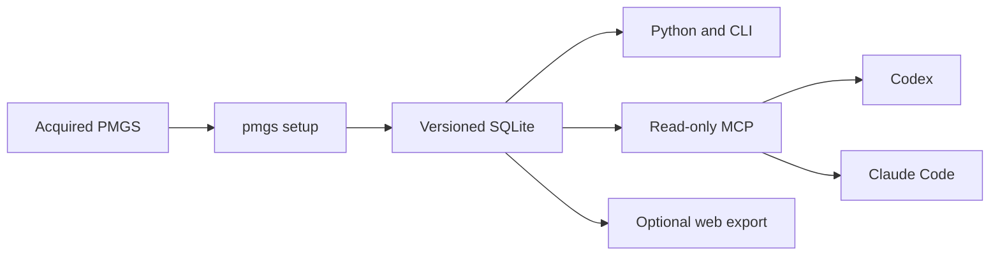

# PMGS Reference

**Search locally acquired JPO PMGS data from Codex and Claude Code with source evidence.**

[日本語](README.md)

PMGS Reference converts an acquired PMGS package into searchable SQLite. Codex and Claude Code can then retrieve FI, F-term, and IPC definitions, hierarchy, editions, related documents, and source metadata through a read-only MCP server. This gives the agent a direct PMGS reference instead of relying only on general web search or model memory.

## Quick setup

After v0.4.0 is available on PyPI, installation takes two commands:

```powershell
uv tool install pmgs-reference
pmgs setup C:\path\to\JPPM2026002
```

To try the current GitHub version:

```powershell
git clone https://github.com/Nagi-Inaba/pmgs-reference.git
Set-Location pmgs-reference
uv tool install .
pmgs setup C:\path\to\JPPM2026002
```

`pmgs setup` inventories the source, builds and validates SQLite, and then activates the verified database. When Codex or Claude Code is detected, it asks whether to register the connection with a default-yes `[Y/n]` prompt. Open a new Codex or Claude Code session after setup.

You can select registration behavior explicitly:

```powershell
pmgs setup C:\path\to\JPPM2026002 --client codex --register
pmgs setup C:\path\to\JPPM2026002 --client both --register
pmgs setup C:\path\to\JPPM2026002 --client none --no-register
```

Running setup again with the same PMGS package reuses the verified database. A new release is activated only after validation, while older databases remain available. See the [Codex and Claude Code setup guide](docs/local-agent-kit.en.md) for custom storage, non-interactive use, and JSON output.

## Questions you can ask

- “What is the exact definition and parent of FI G06F3/048?”
- “Show the meaning and related documents for F-term 4C083 AA01.”
- “Look up G06F3/048 in IPC edition 8U.”
- “Find FI and IPC entries containing the phrase 相互作用技術.”
- “Read the relevant page of the PMGS document linked to this classification.”

For example, ask Codex:

```text
Use $pmgs-reference to look up the definition, hierarchy, edition, and sources for FI G06F3/048.
```

## Features

| Feature | What it provides |
| --- | --- |
| Classification lookup | Definitions, editions, and sources for FI, F-term, and IPC codes |
| Text search | Lexical search over classification text and PMGS documents |
| Hierarchy | Parent, child, and related classifications |
| Related documents | Guides, revision material, and PDFs by page or section |
| Codex and Claude Code | A read-only MCP server and shared skill |
| Python and CLI | Direct access to the same SQLite database |
| Web export | HTML, Markdown, JSON, OpenAPI, and sitemaps for self-hosting |

## How it works



SQLite remains on the user's machine. Python, the CLI, and MCP all resolve the same active release. MCP registrations point to the managed data directory instead of one database file, so a PMGS update does not require editing client configuration.

## Use with Python and the CLI

After running `pmgs setup` with the default data directory, no database path is required:

```python
from pmgs_reference import PMGSStore

store = PMGSStore.open()

record = store.lookup("fi", "G06F3/048")
classifications = store.search("interaction technology", schemes=["fi", "ipc"], language="en")
combined = store.search_pmgs("interaction technology", language="en")
parents = store.parents("fi", "G06F3/048")
documents = store.related_documents("ipc", "G06F3/048", edition="8U")
```

```powershell
pmgs lookup fi "G06F3/048" --json
pmgs search "interaction technology" --scheme fi --scheme ipc --language en --json
pmgs document DOCUMENT_ID --page 1 --json
pmgs doctor --json
```

See [Local reference interfaces](docs/local-interfaces.en.md) for custom data directories and existing SQLite files.

## Build a website for GPTs and Gems

PMGS Reference can generate lightweight HTML, Markdown, JSON, and OpenAPI resources for each classification. An operator can self-host these resources with Cloudflare Worker and R2 so that GPTs and Gems can retrieve definitions through web search or a supported API connection. See the [Web self-hosting guide](docs/self-hosting.en.md) for architecture, generation, and operating-cost considerations.

## PMGS data

PMGS data is not included in the repository or Python package. Complete the JPO registration process and pass the acquired PMGS package to `pmgs setup`.

## Documentation

- [Codex and Claude Code setup](docs/local-agent-kit.en.md)
- [Python, CLI, and MCP interfaces](docs/local-interfaces.en.md)
- [Public API contract](docs/public-api.en.md)
- [Web self-hosting](docs/self-hosting.en.md)
- [Architecture](docs/architecture.md)
- [Current implementation status](docs/current-status.md)
- [Contributing](CONTRIBUTING.md)

## License

The source code is available under the [Apache License 2.0](LICENSE). See [Registered-use terms and publication](docs/registered-use-terms.md) for the PMGS data boundary.
