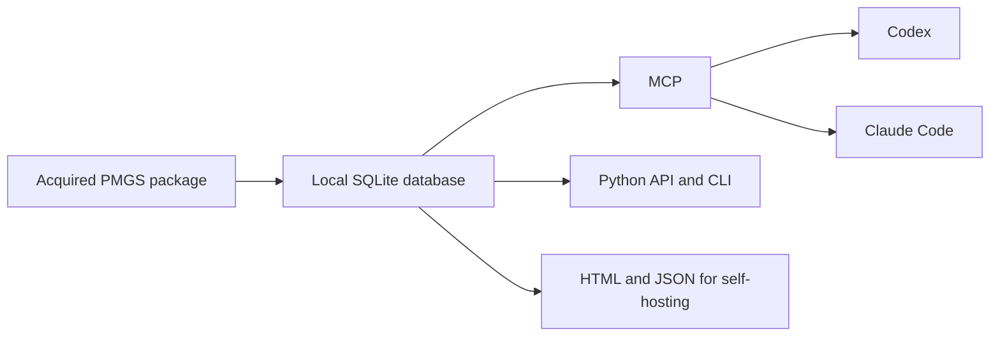

# PMGS Reference

**Search locally acquired JPO PMGS data from Codex, Claude Code, Python, or the command line.**

[日本語](README.md)

PMGS Reference lets Codex and Claude Code answer questions about patent-classification definitions and hierarchy using your local PMGS data.
The agent searches a local SQLite database and returns the matching wording, edition, related documents, and source information.
This gives the agent a direct PMGS reference instead of relying only on general web search or model memory.

## Questions you can ask

- “What is the exact definition and parent of FI G06F3/048?”
- “Show the meaning and related documents for F-term 4C083 AA01.”
- “Look up G06F3/048 in IPC edition 8U.”
- “Find FI and IPC entries containing the phrase 相互作用技術.”
- “Read the relevant page of the PMGS document linked to this classification.”

## How it works



The setup script converts an acquired PMGS package into a searchable SQLite database.
Codex and Claude Code query that database through MCP.
The same database is available through Python and the CLI, and it can generate HTML, Markdown, JSON, and OpenAPI files for self-hosting.

## Features

| Feature | What it provides |
| --- | --- |
| Classification lookup | Definitions, editions, and sources for FI, F-term, and IPC codes |
| Text search | Lexical search over classification text and PMGS documents |
| Hierarchy | Parent, child, and related classifications |
| Related documents | Guides, revision material, and PDFs by page or section |
| Codex and Claude Code | A read-only MCP server and shared skill |
| Python and CLI | Direct programmatic and command-line access to the same data |
| Web export | HTML, Markdown, JSON, OpenAPI, and sitemaps for self-hosting |

## Use with Codex

You need an acquired PMGS package, Python 3.12 or 3.14, [uv](https://docs.astral.sh/uv/), and the Codex CLI.

```powershell
git clone https://github.com/Nagi-Inaba/pmgs-reference.git
Set-Location pmgs-reference

powershell -ExecutionPolicy Bypass -File scripts/setup_local_agent.ps1 `
  -SourceDirectory C:\path\to\JPPM2026002 `
  -ReleaseId JPPM2026002 `
  -Client codex `
  -RegisterClients
```

After setup, ask Codex:

```text
Use $pmgs-reference to look up the definition, hierarchy, and sources for FI G06F3/048.
```

Use `-Client claude` for Claude Code or `-Client both` for both clients.
See the [Codex and Claude Code setup guide](docs/local-agent-kit.en.md) for configuration and updates.

## Use with Python and the CLI

```python
from pmgs_reference import PMGSStore

store = PMGSStore.open(r"C:\path\to\pmgs-reference.sqlite")

record = store.lookup("fi", "G06F3/048")
results = store.search("interaction technology", schemes=["fi", "ipc"], language="en")
parents = store.parents("fi", "G06F3/048")
documents = store.related_documents("ipc", "G06F3/048", edition="8U")
```

```powershell
uv run pmgs lookup fi "G06F3/048" --db C:\path\to\pmgs-reference.sqlite --json
uv run pmgs search "interaction technology" --scheme fi --scheme ipc --language en --db C:\path\to\pmgs-reference.sqlite --json
uv run pmgs document DOCUMENT_ID --page 1 --db C:\path\to\pmgs-reference.sqlite --json
```

See [Local reference interfaces](docs/local-interfaces.md) for all methods and commands.

## Build a website for GPTs and Gems

PMGS Reference can generate lightweight HTML, Markdown, and JSON pages for each classification.
An operator can publish them with Cloudflare Worker and R2 so that GPTs and Gems can retrieve them through web search.
See the [Web self-hosting guide](docs/self-hosting.en.md) for the architecture and deployment steps.

## PMGS data

PMGS data is not included in this repository.
Complete the JPO registration process and pass the acquired PMGS package to the setup script.
The generated SQLite database remains in your local environment.

## Documentation

- [Codex and Claude Code setup](docs/local-agent-kit.en.md)
- [Python, CLI, and MCP interfaces](docs/local-interfaces.md)
- [Web self-hosting](docs/self-hosting.en.md)
- [Architecture](docs/architecture.md)
- [Current implementation status](docs/current-status.md)
- [Contributing](CONTRIBUTING.md)

## License

The source code is available under the [Apache License 2.0](LICENSE).
See [Registered-use terms and publication](docs/registered-use-terms.md) for the PMGS data boundary.
