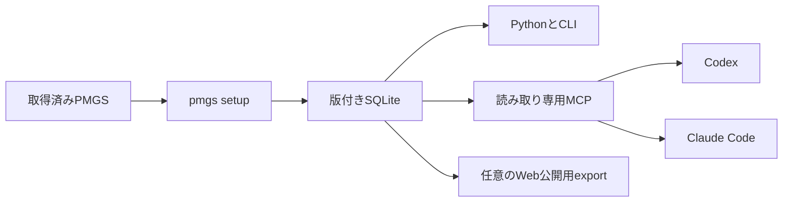

# PMGS Reference

**特許庁のPMGSデータを、CodexやClaude Codeから根拠付きで検索するためのツール**

[English](README.en.md)

PMGS Referenceは、取得済みのPMGSパッケージを検索用SQLiteへ変換し、FI、Fターム、IPCの定義・階層・版・関連資料をAIから参照できるようにします。CodexとClaude Codeは読み取り専用MCPを通じて同じデータを検索するため、一般的なWeb検索やモデルの記憶だけに頼らず、PMGSの文言と出典を確認できます。

## 最短セットアップ

PyPIでv0.3.0が公開された後は、次の2コマンドで導入できます。

```powershell
uv tool install pmgs-reference
pmgs setup C:\path\to\JPPM2026002
```

現在のGitHub版を試す場合は、リポジトリからインストールします。

```powershell
git clone https://github.com/Nagi-Inaba/pmgs-reference.git
Set-Location pmgs-reference
uv tool install .
pmgs setup C:\path\to\JPPM2026002
```

`pmgs setup`はPMGSを棚卸しし、SQLiteを構築・検証してから現行版へ切り替えます。CodexまたはClaude Codeが見つかると、接続を登録するか`[Y/n]`で確認し、既定のEnterで登録します。完了後は新しいCodexまたはClaude Codeのセッションを開いてください。

登録先を明示する場合は次のように指定できます。

```powershell
pmgs setup C:\path\to\JPPM2026002 --client codex --register
pmgs setup C:\path\to\JPPM2026002 --client both --register
pmgs setup C:\path\to\JPPM2026002 --client none --no-register
```

同じPMGSをもう一度指定しても作り直しません。新しい版を指定すると、検証に合格したSQLiteだけを現行版へ切り替え、旧版は残します。保存先、非対話実行、JSON結果などの詳細は[CodexとClaude Codeへの導入ガイド](docs/local-agent-kit.md)にまとめています。

## AIにできる質問

- 「FI G06F3/048の正式な定義と上位分類を確認して」
- 「Fターム 4C083 AA01の意味と関連資料を見せて」
- 「IPC 8U版のG06F3/048を確認して」
- 「『相互作用技術』を含むFIとIPCを探して」
- 「この分類に関連するPMGS文書の該当ページを読んで」

Codexでは、たとえば次のように依頼します。

```text
$pmgs-reference を使って、FI G06F3/048の定義、階層、版、出典を確認して。
```

## できること

| 機能 | 内容 |
| --- | --- |
| 分類コードの検索 | FI、Fターム、IPCの定義、版、出典を取得 |
| キーワード検索 | 分類本文とPMGS文書を文字列で検索 |
| 階層の確認 | 上位分類、下位分類、関連分類を取得 |
| 関連資料の参照 | 解説、改正資料、PDFをページまたは節単位で取得 |
| Codex・Claude Code連携 | 読み取り専用MCPと共通スキルをセットアップ |
| Python・CLI | アプリ、Notebook、スクリプトから同じSQLiteを検索 |
| Web公開用データの生成 | HTML、Markdown、JSON、OpenAPI、サイトマップを生成 |

## 仕組み



SQLiteは利用者の端末に保存され、Python、CLI、MCPが同じ現行版を参照します。MCPの接続先は個別のSQLiteファイルではなく管理ディレクトリなので、PMGSを更新してもクライアント設定を書き換える必要はありません。

## PythonとCLIで使う

`pmgs setup`を既定の保存先で実行した後は、データベースパスを指定せずに開けます。

```python
from pmgs_reference import PMGSStore

store = PMGSStore.open()

record = store.lookup("fi", "G06F3/048")
results = store.search("相互作用技術", schemes=["fi", "ipc"])
parents = store.parents("fi", "G06F3/048")
documents = store.related_documents("ipc", "G06F3/048", edition="8U")
```

```powershell
pmgs lookup fi "G06F3/048" --json
pmgs search "相互作用技術" --scheme fi --scheme ipc --json
pmgs document DOCUMENT_ID --page 1 --json
pmgs doctor --json
```

独自の保存先や既存SQLiteを使う方法は[ローカル参照インターフェース](docs/local-interfaces.md)を参照してください。

## GPTsやGemから参照できるWebサイトを作る

分類ごとの軽量なHTML、Markdown、JSONとOpenAPIを生成できます。Cloudflare WorkerとR2などへセルフホストすると、GPTsやGemはWeb検索や対応するAPI接続から分類定義を参照できます。構成、生成手順、運用費用の考え方は[Webセルフホストガイド](docs/self-hosting.md)に記載しています。

## PMGSデータ

PMGSデータ自体はリポジトリやPythonパッケージに含まれません。特許庁の利用登録後に取得したPMGSパッケージを`pmgs setup`へ指定してください。

## 関連資料

- [CodexとClaude Codeへの導入](docs/local-agent-kit.md)
- [Python、CLI、MCPの仕様](docs/local-interfaces.md)
- [Webセルフホスト](docs/self-hosting.md)
- [システム構成](docs/architecture.md)
- [現在の実装状況](docs/current-status.md)
- [開発への参加](CONTRIBUTING.md)

## ライセンス

ソースコードは[Apache License 2.0](LICENSE)で提供します。PMGSデータの利用条件は[登録条件と公開形態](docs/registered-use-terms.md)を確認してください。
