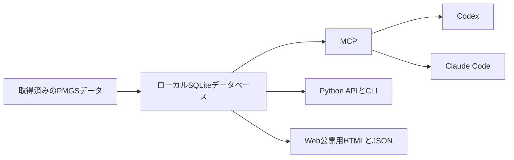

# PMGS Reference

**特許庁のPMGSデータを、CodexやClaude Codeから検索できるようにするツール**

[English](README.en.md)

PMGS Referenceを導入すると、CodexやClaude Codeに特許分類の定義や階層をそのまま質問できます。
AIは手元のPMGSデータベースを検索し、該当する文言、版、関連資料、出典を返します。
一般的なWeb検索やAIの記憶だけに頼らず、PMGSを根拠に分類を確認できます。

## AIにできる質問

- 「FI G06F3/048の正式な定義と上位分類を確認して」
- 「Fターム 4C083 AA01の意味と関連資料を見せて」
- 「IPC 8U版のG06F3/048を確認して」
- 「『相互作用技術』を含むFIとIPCを探して」
- 「この分類に関連するPMGS文書の該当ページを読んで」

## 仕組み



セットアップスクリプトが、取得済みのPMGSパッケージを検索用SQLiteデータベースへ変換します。
CodexとClaude Codeは、MCPを通じて同じデータベースを検索します。
Python APIとCLIから直接検索したり、Web公開用のHTML、Markdown、JSON、OpenAPIを生成したりすることもできます。

## できること

| 機能 | 内容 |
| --- | --- |
| 分類コードの検索 | FI、Fターム、IPCのコードから定義、版、出典を取得 |
| キーワード検索 | 分類の本文やPMGS文書を文字列で検索 |
| 階層の確認 | 上位分類、下位分類、関連分類を取得 |
| 関連資料の参照 | 解説、改正資料、PDFなどをページまたは節単位で取得 |
| CodexとClaude Codeからの利用 | 読み取り専用MCPと共通スキルを導入 |
| PythonとCLIからの利用 | アプリ、Notebook、スクリプトから同じデータを検索 |
| Web公開用データの生成 | HTML、Markdown、JSON、OpenAPI、サイトマップを生成 |

## Codexで使う

次のものを用意します。

- 利用登録を行って取得したPMGSパッケージ
- Python 3.12または3.14
- [uv](https://docs.astral.sh/uv/)
- Codex CLI

```powershell
git clone https://github.com/Nagi-Inaba/pmgs-reference.git
Set-Location pmgs-reference

powershell -ExecutionPolicy Bypass -File scripts/setup_local_agent.ps1 `
  -SourceDirectory C:\path\to\JPPM2026002 `
  -ReleaseId JPPM2026002 `
  -Client codex `
  -RegisterClients
```

セットアップが終わったら、Codexで次のように依頼します。

```text
$pmgs-reference を使って、FI G06F3/048の定義、階層、出典を確認して。
```

Claude Codeで使う場合は`-Client claude`、両方で使う場合は`-Client both`を指定します。
設定先や更新方法は[CodexとClaude Codeへの導入ガイド](docs/local-agent-kit.md)に記載しています。

## PythonとCLIで使う

Python APIでは、分類の検索、階層の取得、関連資料の取得を一つの`PMGSStore`から行えます。

```python
from pmgs_reference import PMGSStore

store = PMGSStore.open(r"C:\path\to\pmgs-reference.sqlite")

record = store.lookup("fi", "G06F3/048")
results = store.search("相互作用技術", schemes=["fi", "ipc"])
parents = store.parents("fi", "G06F3/048")
documents = store.related_documents("ipc", "G06F3/048", edition="8U")
```

CLIからも同じデータを検索できます。

```powershell
uv run pmgs lookup fi "G06F3/048" --db C:\path\to\pmgs-reference.sqlite --json
uv run pmgs search "相互作用技術" --scheme fi --scheme ipc --db C:\path\to\pmgs-reference.sqlite --json
uv run pmgs document DOCUMENT_ID --page 1 --db C:\path\to\pmgs-reference.sqlite --json
```

利用できるメソッドとコマンドは[ローカル参照インターフェース](docs/local-interfaces.md)にまとめています。

## GPTsやGem向けのWebサイトを作る

PMGSの分類ごとに、軽量なHTML、Markdown、JSONを生成できます。
Cloudflare WorkerとR2を使って公開すれば、GPTsやGemがWeb検索から参照できるサイトとして運用できます。
公開手順と構成は[Webセルフホストガイド](docs/self-hosting.md)を参照してください。

## PMGSデータ

PMGSデータ自体は、このリポジトリに含まれていません。
特許庁の利用登録を行い、取得したPMGSパッケージをセットアップスクリプトへ指定します。
生成したSQLiteデータベースは利用者のローカル環境に保存されます。

## 関連資料

- [CodexとClaude Codeへの導入](docs/local-agent-kit.md)
- [Python、CLI、MCPの仕様](docs/local-interfaces.md)
- [Webセルフホスト](docs/self-hosting.md)
- [システム構成](docs/architecture.md)
- [現在の実装状況](docs/current-status.md)
- [開発への参加](CONTRIBUTING.md)

## ライセンス

ソースコードは[Apache License 2.0](LICENSE)で提供します。
PMGSデータの利用条件は[登録条件と公開形態](docs/registered-use-terms.md)を確認してください。
