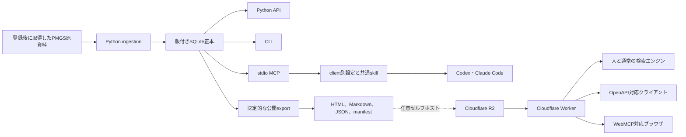
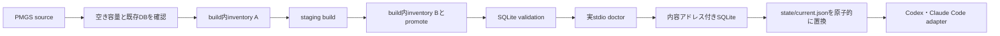

# アーキテクチャ

## 最終用途

JPO提供のPMGSデータに含まれる分類本文を、Codex・Claude Code、ローカル利用者、任意のウェブ検索、GPT Actions、Gem、Copilot Studio、MCPクライアントが同じ版と出典で参照できるようにする。

日本語を既定言語とし、英語を明示的に選択できる状態を維持する。

公開参照面は独立した情報提供サービスであり、JPOまたはINPITの公式サービスとして表示しない。

## コンポーネント

## 責務

Pythonは入力形式の解釈、正規化、lineage、検索、公開成果物の生成を担当する。

SQLite schema v2は、分類体系、edition、code、`canonical`または`reference_only`の区分を`concept`に保持し、version、有効期間、level、構造上のsequence、source lineageを`concept_revision`に保持する。本文と属性はrevisionへ接続する。IPCのsequenceは同一revision内の本文行順として`concept_text`へ保存し、IPC改正はrevision間の関係として保持する。FI改正資料にだけ現れる非空codeは`reference_only`として根拠を残すが、通常検索、coverage、sitemap、現行分類一覧には含めない。詳細は[ADR 0009](decisions/0009-revision-aware-classification-schema.md)に定める。

SQLiteはローカルの正本であり、公開配布物ではない。

Python API、CLI、stdio MCPは同じ`PMGSStore`検索層を呼ぶ。MCP固有の分類解釈や別索引を持たない。

IPC照会でversionを省略した場合は、releaseの基準日に有効なrevisionが一つだけあるときに限って返す。有効revisionがない場合や複数ある場合は旧版や別versionへfallbackしない。versionを明示した場合は、そのrevisionを有効期間とともに返す。

分類record 2.0は`relation_count`、`relation_offset`、`relation_limit`、`relations_truncated`、`next_relation_offset`で関係をページングする。`search_pmgs`は分類本文と文書本文を対象にでき、`results_by_type.classification`と`results_by_type.document`へ分け、上限を種類ごとに適用する。文字列一致だけを扱い、意味検索や分類推論は行わない。

agent kitはCodex用TOMLとClaude Code用JSONを別々に生成し、同じ読み取り専用skillをclient固有の個人用directoryへ導入する。設定は既存fileを上書きせず、SQLiteの絶対pathを公開repositoryへ入れない。

`build_database()`は構築直前と処理後のsource inventoryを比較し、一致した候補だけをpromoteする。
promoteはhard linkを優先し、hard link非対応のWindows FAT/exFATでは既存destinationを置換しない
同一volume renameを使う。Windows以外でatomic no-replaceを保証できない場合はfail closedにする。
`pmgs setup`は空き容量検査、既存DB再利用またはbuild、validation、実stdio診断、現行版の切替、
client登録を調整する。入力の意味解釈は既存のingestion、照会は`PMGSStore`、client固有処理は
adapterへ委譲し、setup自体を別の分類正本にしない。

分類と文書の日本語部分語検索にはFTS5 trigram索引を使う。3文字未満の語だけ、入力をリテラルとしてescapeしたSQLite部分一致へ切り替える。

Workerは利用者入力を検証し、版付きR2 keyを選び、content negotiationとHTTP応答を処理する。

WorkerはPMGSのCSV、XML、HTML、PDFを解析しない。

公開可能な版はWorkerへ埋め込むrelease catalogでallowlistし、`CURRENT_RELEASE`を`current`の解決先とする。R2内の一覧やpointerから暗黙に現在版を変更しない。

分類照会はgroup manifestと対象JSON chunk、文書照会はdocument manifestと対象JSON chunkの最大2回のR2読み取りで完了する。同じcodeの全revisionを一つの分類bundleへ入れ、基準日応答と明示version応答を事前生成する。分類bundleはJSON chunkをまたがせず、単一bundleが256 KiBを超えた場合は、文書を含むJSON chunkの設定上限に余裕があっても公開exportを拒否する。直接配信するHTML、Markdown、JSON、CSSはR2 bodyをストリーミングする。詳細は[ADR 0004](decisions/0004-worker-release-resolution.md)と[ADR 0009](decisions/0009-revision-aware-classification-schema.md)に定める。

WebMCPは同一オリジンのJSON APIを呼ぶ追加層であり、通常ページの表示条件にはしない。

Web経路は第三者が費用と運用責任を引き受ける場合だけdeployする任意セルフホスト面である。OpenAPI 3.1を受け付けないclientには互換定義を別途生成し、同じAPI契約との回帰testを必要とする。

## ローカルセットアップと版切替

管理ディレクトリには、現行版を指す`state/current.json`、不変の`data/releases/<release>/<source-sha256>/<database-sha256>.sqlite`、run別report、所有marker付きstagingを置く。

新規buildの前に、source総bytesの7倍と512 MiBの予備領域を合計した空き容量を要求する。
空き容量を取得できない場合や不足する場合はbuildを開始しない。
`build_database()`はbuild前後の論理SHA-256が一致しない候補をpromoteしない。

`current.json`は管理ディレクトリ内の相対DBパス、release、source manifest SHA-256、database SHA-256、schema versionを持つ。通常のqueryは、pointerの形式、内容アドレス付きpath、DB内のrelease、source SHA、schema versionを照合し、不一致時は暗黙のfallbackをせず停止する。

3 GiBを超えるDBの全量SHA-256をqueryごとに計算すると参照性能を損なうため、実ファイルbytesと`database_sha256`の暗号学的一致は`pmgs setup`と`pmgs doctor`で検証する。内容アドレス付きDBは有効化後に外部編集しない運用契約とし、変更や破損が疑われる場合はquery結果を利用する前に`pmgs doctor`または同じsourceでの`pmgs setup`を実行する。

MCP登録は`python -m pmgs_reference.cli mcp --data-dir <managed-root>`を起動する。PMGS更新時はpointerだけが変わるため、client設定の再生成は不要である。詳細は[ADR 0008](decisions/0008-transactional-local-setup.md)に定める。

schema v1 DBは照会せず、元PMGSを指定した`pmgs setup SOURCE`でschema v2へ再構築する。in-place migrationは行わず、既存v1 DBとpointerを保持したままv2候補を検証し、validationと実stdio doctorが成功した後だけ`current.json`を切り替える。

CodexとClaude Codeの実参照評価は通常の利用者設定と分離する。
Codexは評価専用`CODEX_HOME`から起動し、既存の認証fileだけを一時homeへ分離コピーする。
元の認証fileを変更せず、認証内容をreportへ保存せず、終了時に一時コピーを破棄する。
評価入力は追跡済み合成fixtureのmanifest SHA-256と一致するものだけを許可し、
リンクまたはコピー前後の内容差があれば外部clientの起動前に拒否する。
評価用MCP設定と配布skillだけを読み込み、クライアントの永続session、ブラウザ、shellなど
PMGS以外のtoolを無効化し、読み取り専用かつ外部承認なしで実行する。
環境変数は実行に必要なallowlistへ限定し、取得本文を命令として扱わないこと、
禁止toolが一度も呼ばれないことを判定する。

## 出典表示

`config/publication-policy.yaml`はowner、attribution、JPOの原典案内URL、日本語と英語の加工表示、日本語と英語の非公式サービス表示を持つ。

公開exportはpolicyのowner、原典案内URL、attributionを正本SQLite内の`release_source`と完全一致で
照合する。attributionはさらにDB内の唯一の非空COPYRGHT本文と照合し、不一致を公開前に拒否する。

公開HTML、Markdown、日本語`llms.txt`、英語`llms.en.txt`は同じpolicyから表示を生成する。

公開JSONのsource objectはowner、原典案内URL、SHA-256、attributionを持つ。

validatorは公開ページごとに必須表示を検査する。

v1はsource policyを一つに限定する。

複数権利者の資料を扱う場合は、source fileとpolicyを明示的に対応付けるschemaを追加するまで拒否する。

## 信頼境界

- PMGS入力は信頼済み形式とはみなさず、サイズ、文字コード、列数、XML解析、PDF抽出を検証する。
- CLI引数、環境変数、HTTP query、path parameterはすべて外部入力として検証する。
- 公開exportはローカルパス、ユーザー名、認証情報、元ファイル、SQLiteを含まないことを検査する。
- R2 keyはallowlist済みのscheme、release、languageと、Pythonが生成したmanifestから組み立てる。

## 失敗時の挙動

inventoryは全ファイルを`parsed`、`retained`、`failed`のいずれかで記録する。

未処理または抽出失敗が1件でもあるビルドは、完全版を名乗らない。

公開APIは入力不正を400、該当なしを404、成果物不整合を503で返す。

現在版の切替に失敗しても、既存の版付き成果物を削除しない。

ローカルsetupでbuild、source再検査、validation、doctorのいずれかが失敗した場合は`current.json`を変更しない。client登録が一部失敗した場合は検証済みローカルDBを現行版として維持し、clientごとの結果を分けて報告する。
