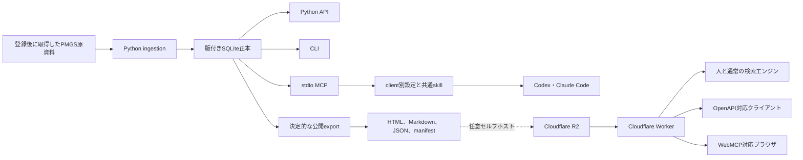
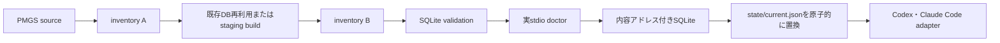

# アーキテクチャ

## 最終用途

JPO提供のPMGSデータに含まれる分類本文を、Codex・Claude Code、ローカル利用者、任意のウェブ検索、GPT Actions、Gem、Copilot Studio、MCPクライアントが同じ版と出典で参照できるようにする。

日本語を既定言語とし、英語を明示的に選択できる状態を維持する。

公開参照面は独立した情報提供サービスであり、JPOまたはINPITの公式サービスとして表示しない。

## コンポーネント

## 責務

Pythonは入力形式の解釈、正規化、lineage、検索、公開成果物の生成を担当する。

SQLiteはローカルの正本であり、公開配布物ではない。

Python API、CLI、stdio MCPは同じ`PMGSStore`検索層を呼ぶ。MCP固有の分類解釈や別索引を持たない。

agent kitはCodex用TOMLとClaude Code用JSONを別々に生成し、同じ読み取り専用skillをclient固有の個人用directoryへ導入する。設定は既存fileを上書きせず、SQLiteの絶対pathを公開repositoryへ入れない。

`pmgs setup`はinventory、build、validation、実stdio診断、現行版の切替、client登録を一つのトランザクションとして調整する。入力の意味解釈は既存のingestion、照会は`PMGSStore`、client固有処理はadapterへ委譲し、setup自体を別の分類正本にしない。

分類と文書の日本語部分語検索にはFTS5 trigram索引を使う。3文字未満の語だけ、入力をリテラルとしてescapeしたSQLite部分一致へ切り替える。

Workerは利用者入力を検証し、版付きR2 keyを選び、content negotiationとHTTP応答を処理する。

WorkerはPMGSのCSV、XML、HTML、PDFを解析しない。

公開可能な版はWorkerへ埋め込むrelease catalogでallowlistし、`CURRENT_RELEASE`を`current`の解決先とする。R2内の一覧やpointerから暗黙に現在版を変更しない。

分類照会はgroup manifestと対象JSON chunk、文書照会はdocument manifestと対象JSON chunkの最大2回のR2読み取りで完了する。直接配信するHTML、Markdown、JSON、CSSはR2 bodyをストリーミングする。詳細は[ADR 0004](decisions/0004-worker-release-resolution.md)に定める。

WebMCPは同一オリジンのJSON APIを呼ぶ追加層であり、通常ページの表示条件にはしない。

Web経路は第三者が費用と運用責任を引き受ける場合だけdeployする任意セルフホスト面である。OpenAPI 3.1を受け付けないclientには互換定義を別途生成し、同じAPI契約との回帰testを必要とする。

## ローカルセットアップと版切替

管理ディレクトリには、現行版を指す`state/current.json`、不変の`data/releases/<release>/<source-sha256>/<database-sha256>.sqlite`、run別report、所有marker付きstagingを置く。

`current.json`は管理ディレクトリ内の相対DBパス、release、source manifest SHA-256、database SHA-256、schema versionを持つ。pointerとDBのidentityが一致しない場合、queryとsetupはいずれも暗黙のfallbackをせず停止する。

MCP登録は`python -m pmgs_reference.cli mcp --data-dir <managed-root>`を起動する。PMGS更新時はpointerだけが変わるため、client設定の再生成は不要である。詳細は[ADR 0008](decisions/0008-transactional-local-setup.md)に定める。

## 出典表示

`config/publication-policy.yaml`はowner、attribution、JPOの原典案内URL、日本語と英語の加工表示、日本語と英語の非公式サービス表示を持つ。

公開exportはpolicyのattributionを正本SQLite内の`COPYRGHT`と照合し、不一致を公開前に拒否する。

公開HTML、Markdown、日本語`llms.txt`、英語`llms.en.txt`は同じpolicyから表示を生成する。

公開JSONのsource objectはowner、原典案内URL、SHA-256、attributionを持つ。

validatorは公開ページごとに必須表示を検査する。

v1はsource policyを一つに限定する。

複数権利者の資料を扱う場合は、source fileとpolicyを明示的に対応付けるschemaを追加するまで拒否する。

## 信頼境界

- PMGS入力は信頼済み形式とはみなさず、サイズ、文字コード、列数、XML解析、PDF抽出を検証する。
- CLI引数、環境変数、HTTP query、path parameterはすべて外部入力として検証する。
- 公開exportはローカルパス、ユーザー名、認証情報、元ファイル、SQLiteを含まないことを検査する。
- R2 keyはallowlist済みのscheme、release、languageと、Pythonが生成したmanifestから組み立てる。

## 失敗時の挙動

inventoryは全ファイルを`parsed`、`retained`、`failed`のいずれかで記録する。

未処理または抽出失敗が1件でもあるビルドは、完全版を名乗らない。

公開APIは入力不正を400、該当なしを404、成果物不整合を503で返す。

現在版の切替に失敗しても、既存の版付き成果物を削除しない。

ローカルsetupでbuild、source再検査、validation、doctorのいずれかが失敗した場合は`current.json`を変更しない。client登録が一部失敗した場合は検証済みローカルDBを現行版として維持し、clientごとの結果を分けて報告する。
