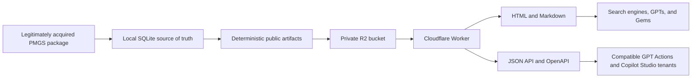

# Web self-hosting for GPTs and Gems

[日本語](self-hosting.md)

## Status and responsibility

The repository maintainers do not currently operate a PMGS Reference website, R2 bucket, Worker, or custom domain. This guide is for a third-party operator who supplies their own legitimately acquired PMGS package, Cloudflare account, domain, budget, and ongoing operational responsibility.

Cloning the repository does not create a public URL usable by GPTs, Gems, or Copilot Studio.

## Architecture



Python performs all source parsing locally. The Worker resolves validated manifests and fixed R2 prefixes; it does not parse PMGS source files. Normal HTML, Markdown, JSON, and OpenAPI do not depend on WebMCP.

## Capacity and cost categories

The immediately preceding contract audited on 2026-08-09 contained 399,025 objects and 10,491,136,463 bytes per export. The 2026-08-10 Japanese and English entry-point change adds objects, so this is a planning baseline rather than a current deployment measurement. A/B reproducibility validation requires two independent copies plus working space.

As checked on 2026-08-10, Cloudflare publishes an R2 free allocation of 10 GB-month, one million Class A operations, and ten million Class B operations per month. Workers Paid starts at USD 5 per account per month. Recheck the current [R2 pricing](https://developers.cloudflare.com/r2/pricing/) and [Workers pricing](https://developers.cloudflare.com/workers/platform/pricing/) before deployment.

Budget for storage, object writes, object reads, Worker requests and CPU, domain registration, build disk, upload bandwidth and retries, logs, monitoring, and retained historical releases. Cloudflare documents `r2.dev` as a testing endpoint with variable rate limits and recommends a custom domain for production; see [R2 limits](https://developers.cloudflare.com/r2/platform/limits/) and [Worker custom domains](https://developers.cloudflare.com/workers/configuration/routing/custom-domains/).

## Build and audit with the real origin

Generate two fresh candidates with the final HTTPS origin. Do not upload a previous `.example` build.

```powershell
uv sync --frozen --all-groups
uv run --frozen pmgs export-public --db data\pmgs-reference.sqlite --policy config\publication-policy.yaml --output build\public-a --base-url https://pmgs.example.jp --max-json-chunk-bytes 262144 --report build\reports\public-a-export.json
uv run --frozen pmgs validate-public build\public-a --report build\reports\public-a-validation.json
```

Generate `public-b` independently and complete the A/B checks in the [release runbook](release-runbook.md). Do not upload until `audit-public` reports `ready=true` and the database hash, source-manifest hash, counts, bytes, tree hash, coverage, and notices all pass.

Japanese is the default public language under `/` and `/ja/`; English is available under `/en/`.

## Upload and deploy

Keep the R2 bucket private and read it through the Worker's `PMGS_BUCKET` binding.

```powershell
Set-Location worker
npx wrangler login
npx wrangler r2 bucket create pmgs-reference-public
```

For roughly 399,000 objects, use Cloudflare's [S3-compatible API](https://developers.cloudflare.com/r2/api/s3/) or its [rclone procedure](https://developers.cloudflare.com/r2/examples/rclone/) instead of a serial `wrangler r2 object put` loop.

The upload process must preserve relative keys, avoid overwriting published releases, keep credentials out of commands and logs, record remote counts and bytes, and compare the complete remote inventory with local manifests. Sampling is not a full verification. This repository does not ship a bulk uploader, so the operator must audit the chosen transfer tool and implement the full post-upload comparison.

Update the R2 bucket name, `CURRENT_RELEASE`, and `RELEASE_CATALOG_JSON` in `worker/wrangler.jsonc` only after all objects are present and verified.

```powershell
npm --prefix worker ci
npm --prefix worker run verify
npx --prefix worker wrangler deploy
```

Connect an HTTPS custom domain, then test `/`, `/ja/`, `/en/`, `/api/v1/lookup`, `/openapi.json`, `/llms.txt`, `/llms.en.txt`, `/robots.txt`, and `/sitemap.xml` from an external network. Check status, content type, canonical URL, attribution, CORS, caching, security headers, error responses, and old release URLs.

## Search discovery

Submit the sitemap through the search-management tools used by the operator. [Google Search Central](https://developers.google.com/search/docs/crawling-indexing/sitemaps/overview) states that a sitemap helps URL discovery but does not guarantee crawling or indexing. Search visibility, AI retrieval, and source selection are three separate states.

## GPTs

For web retrieval, instruct the GPT to search the public PMGS Reference domain, distinguish FI, F-term, IPC, and IPC editions, cite the retrieved URL and release, and report unavailable rather than guessing. This is best effort; instructions do not guarantee that a domain is consulted for every answer.

If the current GPT editor exposes Actions and accepts OpenAPI 3.1, import `https://pmgs.example.jp/openapi.json` and test `lookupPatentClassification`, `getPmgsDocument`, `listPmgsReleases`, and `getPmgsCoverage`. If the editor requires a different OpenAPI version, convert the contract without changing its input constraints or response semantics and test all error paths. The repository does not create or publish a GPT.

## Gems

Google's current [custom Gem guidance](https://support.google.com/gemini/answer/15235603?hl=en) documents instructions and Knowledge files. It does not document arbitrary OpenAPI tool registration for a general Gem. Therefore, avoid uploading the full PMGS dataset as Knowledge and use the indexed public site through web retrieval as a best-effort route.

Instruct the Gem to prioritize the PMGS Reference domain, distinguish schemes and editions, cite the exact page and release, and report an unverified result when the page cannot be retrieved. Test actual source links in conversations.

## Copilot Studio

Where tenant policy permits, Copilot Studio can call the JSON API through a REST API tool or Power Platform custom connector. [Microsoft Learn](https://learn.microsoft.com/en-us/training/modules/take-action-external-systems-connector-rest-api-tools-copilot-studio/) documents REST API tools based on OpenAPI specifications.

Some current Power Platform custom-connector flows require an OpenAPI 2.0 definition under 1 MB. PMGS Reference emits OpenAPI 3.1, so direct import is not guaranteed. First test whether the tenant's current REST API tool accepts 3.1. If it does not, generate and maintain a Power Platform-compatible OpenAPI 2.0 definition, then test FI, F-term, IPC, editions, and 400, 404, and 503 responses.

The repository does not currently emit a Power Platform-specific OpenAPI 2.0 artifact.

## Security and operations

- Never expose the source archive, SQLite, bulk JSON, internal object keys, stack traces, or filesystem paths.
- Never concatenate user input directly into an R2 key.
- Monitor rate limits, cache behavior, bot traffic, Worker CPU, R2 Class B operations, and 5xx responses.
- Define privacy notices and retention when logs contain queries or IP addresses.
- Switch current releases only through an explicit Worker deployment after upload verification.
- Roll back the Worker to a verified old release without deleting R2 objects during an incident.
- Keep attribution, processing, non-affiliation, terms, and contact information visible.

If no operator can maintain cost, uptime, notices, privacy, abuse handling, and client compatibility, use the local MCP distribution instead.
