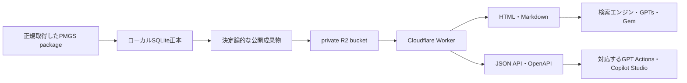

# GPTs・Gem向けWebセルフホスト

[English](self-hosting.en.md)

## このガイドの位置付け

このリポジトリの管理者は、PMGS ReferenceのWebサイト、Cloudflare R2、Worker、独自ドメインを現在運営していない。

本ガイドは、第三者が自分のPMGS package、Cloudflareアカウント、ドメイン、予算、運用責任を用意して公開するための設計資料である。リポジトリをcloneしただけでは、GPTs、Gem、Copilot Studioから参照できる公開URLは生まれない。

## 公開構成



Pythonはローカルで原資料を解析し、公開可能なbytesを事前生成する。Workerは原資料を解析せず、検証済みmanifestと固定prefixからR2 objectを選んで返す。分類照会と文書照会の正常応答は、最大2回のR2 readで完了する。

schema 2.0では同一分類codeの全revisionを一つのbundleへ保持する。Workerは有効期間を再計算せず、
基準日用recordまたは指定されたIPC `version=YYYY.MM`を選ぶ。`relation_limit`は既定50、最大200である。
単一bundleが256 KiBを超えるrelease候補はexport段階で拒否される。

通常のHTML、Markdown、JSON、OpenAPIはWebMCPに依存しない。WebMCPは対応ブラウザが存在するときだけ登録する任意機能であり、GPTsやGemとの接続を保証する仕組みではない。

## 公開前提

運用者は次を用意する。

- 正規に取得したPMGS package
- Python 3.12または3.14と`uv`
- Node.js 22とnpm 10
- Cloudflareアカウント、R2 bucket、Worker
- 公開用の独自ドメインまたはsubdomain
- 長時間の全量export、upload、検証を実行できるローカル容量と回線
- 公開ポリシー、帰属表示、障害対応、費用を継続管理する担当者

PMGS原資料、SQLite、登録情報、認証情報をGit、R2の公開prefix、Worker responseへ入れない。

## 現在の全量規模と費用項目

2026-08-09に監査した直前契約の全量候補は、1回のexportにつき399,025 object、10,491,136,463 bytesだった。2026-08-10の日英入口追加により現行契約のobjectは増えるため、この数値は容量見積りの基準であり、公開前の実測値ではない。A/B再現検査には、同規模の空き容量が2系統分と作業領域として必要になる。

2026-08-10確認時点のCloudflare料金表では、R2 Standardに月10 GB-month、Class A 100万回、Class B 1,000万回の無料枠があり、Workers Paidはアカウントあたり月額5 USDからである。料金と無料枠は変更されるため、公開判断時に[R2料金](https://developers.cloudflare.com/r2/pricing/)と[Workers料金](https://developers.cloudflare.com/workers/platform/pricing/)を再確認する。

費用を左右する項目は次のとおりである。

| 項目 | この構成での発生要因 |
| --- | --- |
| R2 storage | 現行候補は約10.49 GB。版を追加して旧版を保持すると累積する |
| Class A | 初回upload、版追加、metadata操作。現行候補は約39.9万object |
| Class B | HTML・Markdownの配信、APIのmanifestとchunk read |
| Worker | request数、CPU時間、選択したplan |
| ドメイン | registrar、DNS、更新費用 |
| build・upload | ローカルdisk、回線、CI runner、失敗時の再送 |
| 監視 | log、alert、稼働確認、必要なら外部監視service |

R2からInternetへのegressは公式料金表で無料とされているが、組み合わせる別serviceには料金が生じ得る。`r2.dev`は本番向けではなく可変rate limitがあるため、Cloudflareも本番にはcustom domainを案内している。[R2 limits](https://developers.cloudflare.com/r2/platform/limits/)と[Workers custom domains](https://developers.cloudflare.com/workers/configuration/routing/custom-domains/)を参照する。

## 1. 実originで公開候補を再生成する

予約済み`.example`を使った過去の監査結果を、そのまま本番成果物としてuploadしない。確定したHTTPS originを`--base-url`へ渡し、空の別directoryへA/B生成する。

```powershell
uv sync --frozen --all-groups

uv run --frozen pmgs export-public `
  --db data\pmgs-reference.sqlite `
  --policy config\publication-policy.yaml `
  --output build\public-a `
  --base-url https://pmgs.example.jp `
  --max-json-chunk-bytes 262144 `
  --report build\reports\public-a-export.json

uv run --frozen pmgs validate-public build\public-a `
  --report build\reports\public-a-validation.json
```

`public-b`も新規生成し、[リリース手順](release-runbook.md)どおりにDB hash、source manifest hash、件数、bytes、tree hash、coverage、出典表示を比較する。`audit-public`が`ready=true`になるまでuploadしない。

公開成果物は日本語topの`/`と`/ja/`、英語topの`/en/`、`/openapi.json`、日本語`/llms.txt`、英語`/llms.en.txt`、`/robots.txt`、shard済みsitemapを含む。日本語が既定である。

## 2. R2へ版付きでuploadする

R2 bucketはpublic bucketにせず、Workerの`PMGS_BUCKET` bindingからだけ読む構成を推奨する。

```powershell
Set-Location worker
npx wrangler login
npx wrangler r2 bucket create pmgs-reference-public
```

約39.9万objectを`wrangler r2 object put`の単純loopで送るのは遅い。Cloudflareの[S3互換API](https://developers.cloudflare.com/r2/api/s3/)または[rclone手順](https://developers.cloudflare.com/r2/examples/rclone/)を使い、`build/public-a/`の相対pathを保持して版付き成果物をuploadする。

upload処理には次の要件を持たせる。

- secretをcommand line、Git、logへ出さない。
- 既存版を上書きせず、未公開の新しい版prefixへ追加する。
- object count、合計bytes、失敗件数を保存する。
- upload後にremote inventoryを取得し、ローカルmanifestと全件照合する。
- sample確認だけで「全量一致」と報告しない。
- 不一致が一つでもあればWorkerのcurrentを切り替えない。

このリポジトリは外部R2へのbulk uploaderを同梱していない。運用者は使う転送toolと認証方式を監査し、upload後の全件照合を実装する必要がある。

## 3. Workerを設定してdeployする

`worker/wrangler.jsonc`の次の値を運用環境へ合わせる。

- `r2_buckets[].bucket_name`
- `CURRENT_RELEASE`
- `RELEASE_CATALOG_JSON`
- Worker名、observability sampling、必要なCPU limit

R2上の可変pointerやdirectory listingからcurrent releaseを自動決定しない。新しい版を全量uploadして照合した後にだけ、catalogへ追加して`CURRENT_RELEASE`を切り替える。

```powershell
npm --prefix worker ci
npm --prefix worker run verify
npx --prefix worker wrangler deploy
```

deploy後に[Cloudflareのcustom domain手順](https://developers.cloudflare.com/workers/configuration/routing/custom-domains/)でHTTPS domainを接続する。

## 4. 本番URLを検証する

少なくとも次を外部networkから確認する。

```powershell
Invoke-WebRequest https://pmgs.example.jp/ja/
Invoke-WebRequest https://pmgs.example.jp/en/
Invoke-WebRequest "https://pmgs.example.jp/api/v1/lookup?scheme=fi&code=G06F3%2F048&language=ja"
Invoke-WebRequest https://pmgs.example.jp/openapi.json
Invoke-WebRequest https://pmgs.example.jp/llms.txt
Invoke-WebRequest https://pmgs.example.jp/robots.txt
Invoke-WebRequest https://pmgs.example.jp/sitemap.xml
```

確認対象はstatus、Content-Type、canonical URL、出典表示、CORS、cache、security header、
version選択、relation pagination、HTTP 200の`version_not_found`と`not_valid_at_release`、404、400、503、
API response schema、旧版URLである。外部からの実測前に「公開済み」「GPTから利用可能」と報告しない。

## 5. 検索エンジンへ発見させる

サイト内link、`robots.txt`、sitemap index、個別sitemap、canonical URL、`llms.txt`を本番originで検査する。Google Search Consoleなど、運用者が利用する検索管理画面へsitemapを送信する。

[Google Search Central](https://developers.google.com/search/docs/crawling-indexing/sitemaps/overview)が説明するとおり、sitemapはURLの発見を助けるが、全ページのcrawlやindexを保証しない。399,025 objectを持つ大規模サイトでは、重要な入口と内部linkを整え、index coverageを継続観測する。

## 6. GPTsから参照する

### Web検索を使う場合

GPTへ次のような指示を与える。

```text
特許分類の定義を述べる前に、https://pmgs.example.jp の該当ページを検索してください。
FI、Fターム、IPCとIPC版を区別し、公式文言、PMGSリリース、出典URLを示してください。
該当ページを取得できない場合は、推測した定義で補わず「参照できない」と回答してください。
回答は日本語を既定とし、利用者が英語を指定した場合だけ英語に切り替えてください。
```

この指示は参照確率を上げるためのもので、特定domainの利用を毎回答で保証しない。検索結果に現れることと、GPTがそのページを根拠として採用することは別の状態である。

### GPT Actionsを使う場合

利用中のGPT editorがActionsを表示し、OpenAPI 3.1を受け付けることを確認してから、`https://pmgs.example.jp/openapi.json`をimportする。

主なoperationは次のとおりである。

- `lookupPatentClassification`
- `getPmgsDocument`
- `listPmgsReleases`
- `getPmgsCoverage`

editorがOpenAPI 3.1を受け付けない場合は、APIの入力制約とresponse schemaを変えずに、そのeditorが要求する版へ変換する。変換後のschemaもsource repositoryで管理し、previewで400、404、503を含めてtestする。

Actionsの画面、対応版、公開審査条件は変更され得る。このリポジトリはGPTを作成せず、外部editorでの取込み成功も保証しない。

## 7. Gemから参照する

Googleの現行[カスタムGem案内](https://support.google.com/gemini/answer/15235603?hl=en)は、instructionsとKnowledge fileを案内している。任意のOpenAPI endpointを一般的なGemへ直接tool登録する手順は、この公式案内では確認できない。そのため、全量PMGSをKnowledgeへuploadせず、公開サイトをWeb検索で参照する方法をbest effortとして使う。

Gemのinstructions例：

```text
特許分類の正確な定義が必要なときは、https://pmgs.example.jp を優先して検索してください。
FI、Fターム、IPCとIPC版を区別し、取得したページのURL、PMGSリリース、公式文言を示してください。
検索結果だけから分類を推測せず、該当ページを取得できなければ未確認と回答してください。
回答は日本語を既定とし、英語を指定された場合だけ英語に切り替えてください。
```

Geminiが表示するsource linkの有無と内容を実際の会話で検査する。Knowledge fileの容量問題を解決する方法ではなく、公開Webの発見性に依存する方法である。

## 8. Copilot Studioから参照する

Copilot Studioは、tenant policyと権限が許す場合、REST API toolまたはPower Platform custom connectorから公開JSON APIを呼び出せる。[Microsoft Learn](https://learn.microsoft.com/en-us/training/modules/take-action-external-systems-connector-rest-api-tools-copilot-studio/)はOpenAPI specificationを使うREST API toolを案内している。

ただし、Power Platformのcustom connector経路にはOpenAPI 2.0と1 MB未満を要求する現行手順がある。PMGS Referenceが生成する`/openapi.json`はOpenAPI 3.1であり、すべてのCopilot Studio環境へそのままimportできるとは限らない。

運用者は次の順で確認する。

1. 対象tenantの新しいREST API toolがOpenAPI 3.1を受け付けるか確認する。
2. 受け付けない場合は、`/openapi.json`からPower Platform向けOpenAPI 2.0定義を生成する。
3. `lookupPatentClassification`を読み取り専用actionとしてimportする。
4. 認証なしの公開APIを組織policyが許すか確認する。許さない場合はWorkerへ認証を追加し、connector側も同じ方式で設定する。
5. FI、Fターム、IPC、IPC版、400、404、503をtestする。

このリポジトリはPower Platform専用OpenAPI 2.0成果物を現時点では生成しない。互換定義を追加する場合は、OpenAPI 3.1正本との契約差分と回帰testを同時に追加する。

## 運用とセキュリティ

- R2 bucketを直接公開せず、Workerでroute、key、response sizeを制限する。
- 利用者入力をR2 keyへ直接連結しない。
- source archive、SQLite、bulk JSON、内部object key、stack trace、filesystem pathを返さない。
- rate limit、cache、bot traffic、Worker CPU、R2 Class B、5xxを監視する。
- 観測logへ検索語やIPを保存する場合は、privacy noticeと保持期間を定める。
- 現在版の切替はdeployとして行い、upload途中の版を公開しない。
- 障害時はWorkerのcurrentだけを検証済み旧版へ戻し、R2 objectを急いで削除しない。
- 利用規約、帰属表示、非公式サービス表示、問い合わせ先を公開ページから確認できるようにする。

公開者は費用、稼働、権利表示、privacy、Abuse対応、外部AI製品の仕様変更を継続管理する。この責任を引き受けられない場合は、ローカルMCPだけを使う。
